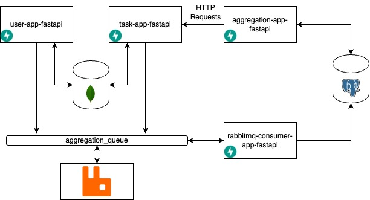

# Microservice "Aggregation Pattern" architecture
This is an example of the implementation of the microservice aggregation pattern architecture in a simple to-do application, without UI and any extra features.

##Architecture diagram

